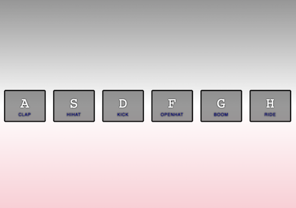
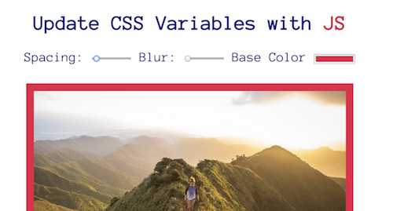

# Wes Bos JavaScript30 Challenge.

This free Javascript 30 day coding challenge was created by [WesBos](https://github.com/wesbos).

Track my progress here:

## Day 1: 24th December

##### Project 1: JS Drum-kit

**Notes:** In this project I learned about data attributes, keyCodes and playing audio.

**Tools:** I was introduced to [this](https://keycode.info/) great site which makes it easy to find the code of any key.

**Demo:** You can see this project [here](https://jessdiv.github.io/Javascript30/project01-JavaScript-Drumkit/index.html)

##### Project 2: JS/CSS Clock

**Notes:** This lesson went over getting the time, using cubix-bezier and rotating/transitions in css.

**Demo:** You can see this project [here](https://jessdiv.github.io/Javascript30/project02-JS-CSS-Clock/index.html)

## Day 2: 26th December

##### Project 3: CSS Variables

**Notes:** I learned CSS variables and data attributes.

**Demo:** You can see this project [here](https://jessdiv.github.io/Javascript30/project03-CSS-Variables/index.html)

##### Project 4: Array Cardio Day 1

**Notes:** I learned about a bunch of methods used to manipulate arrays- map, filter, sort and reduce.

**Demo:** You can see this project [here](https://jessdiv.github.io/Javascript30/project04-Array-Cardio-Day-1/index.html)

## Day 3: 29th December

##### Project 5: CSS Variables

**Notes:** In this lesson I learned about CSS properties flex and transform. I'd like to look further into flexbox.

**Tools:** Wes recommeded [this](https://flexbox.io/) free course to get more familiar with flex box.

**Demo:** You can see this project [here](https://jessdiv.github.io/Javascript30/project05-flex-panels-image-gallery/index.html)

