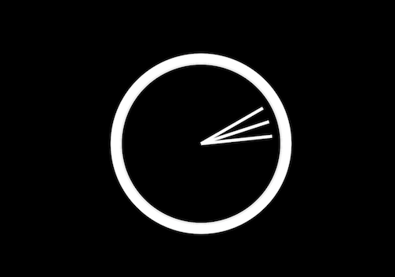

# Wes Bos JavaScript30 Challenge.

This free Javascript 30 day coding challenge was created by [WesBos](https://github.com/wesbos).

Track my progress here:

## Day 1: 24th December

##### Project 1: JS Drum-kit

*Notes:* In this project I learned about data attributes, keyCodes and playing audio.

*Tools:* I was introduced to [this](https://keycode.info/) great site which makes it easy to find the code of any key.

*Demo:* You can see this project [here](https://jessdiv.github.io/Javascript30/project01%20-%20JavaScript%20Drumkit/index-START.html)

##### Project 2: JS/CSS Clock

*Notes:* This lesson went over getting the time, using cubix-bezier and rotating/transitions in css.

*Demo:* You can see this project [here](https://jessdiv.github.io/Javascript30/project01%20-%20JavaScript%20Drumkit/index-START.html)

## Day 2: 26th December

##### Project 3: CSS Variables

##### Project 4: Array Cardio Day 1

## Day 3: 27th December

##### Project 5: Flex Panel Gallery

##### Project 6: Type Ahead
